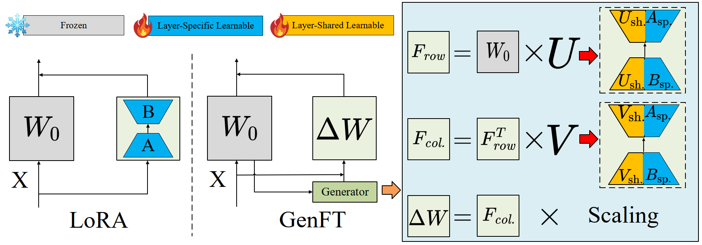

# 🚀 GenFT

<p align="center">
  <strong>GenFT: A Generative Parameter-Efficient Fine-Tuning Method for Pretrained Foundation Models</strong>
</p>

<p align="center">
  <a href="https://www.modelscope.cn/models/xuguangzhu/GenFT-LoRA-Weights">📦 ModelScope Weights</a> ·
  <a href="#environment-setup">⚙️ Environment</a> ·
  <a href="#data-preparation">📚 Data</a> ·
  <a href="#running">🚀 Running</a> ·
  <a href="#citation">📌 Citation</a>
</p>

Official source code for the paper *“GenFT: A Generative Parameter-Efficient Fine-Tuning Method for Pretrained Foundation Models”*, accepted at ICANN 2026.

---

## ✨ Highlights

* 🧬 **Generative PEFT** for pretrained foundation models
* 🧱 Compatible with **RoBERTa, ViT-B/16, and LLaMA-7B**
* 🌐 Supports **NLP and vision** adaptation tasks
* 🧪 Includes reproduction scripts for **GLUE, VTAB-1K, FGVC, and LLaMA instruction tuning**
* 📦 Released adapters are available on **ModelScope**

---

## 🧩 Overall Architecture

<p align="center">
  
</p>

---

## 📦 ModelScope Weights

The released GenFT adapter weights are available at:

```text
xuguangzhu/GenFT-LoRA-Weights
```

This repository stores the released GenFT adapters for GLUE, VTAB-1K, FGVC, and LLaMA-related experiments. Evaluation scripts support both local adapter paths and ModelScope adapter paths.

Example:

```bash
ADAPTER_PATH=modelscope://xuguangzhu/GenFT-LoRA-Weights/best_vtab/cifar \
  bash scripts/test_vtab.sh cifar
```

If the adapters are downloaded locally, use the local directory:

```bash
ADAPTER_PATH=outputs/best_vtab/cifar \
  bash scripts/test_vtab.sh cifar
```

---
<a id="environment-setup"></a>
## ⚙️ Environment Setup

```bash
git clone https://github.com/xuguangning1218/GenFT
cd GenFT

conda create -n genft python=3.10 -y
conda activate genft

pip install -r requirements.txt
pip install -e third_party/peft

export PYTHONPATH=$PWD:$PYTHONPATH
```

If the local `genft` package cannot be found, install this repository in editable mode:

```bash
pip install -e .
```

---
<a id="data-preparation"></a>
## 📚 Data Preparation

### 📝 Text Task

GLUE datasets are automatically downloaded from Hugging Face:

```python
load_dataset("nyu-mll/glue", task)
```

The default text backbone is:

```text
FacebookAI/roberta-base
```

### 🖼️ Image Task

The image classification setup follows [V-PETL Bench](https://github.com/synbol/Parameter-Efficient-Transfer-Learning-Benchmark).

Supported image benchmarks:
- VTAB-1K: `XiN0919/VTAB-1k` on Hugging Face
- FGVC metadata: `XiN0919/FGVC` on Hugging Face

Prepare the ViT-B/16 ImageNet-21K checkpoint:

```bash
mkdir -p pretrained
wget https://storage.googleapis.com/vit_models/imagenet21k/ViT-B_16.npz \
  -O pretrained/ViT-B_16.npz
```

Expected local directory layout:

```text
data/
├── vtab-1k/
│   ├── cifar/
│   │   ├── train800val200.txt
│   │   └── test.txt
│   └── ...
└── fgvc/
    ├── CUB_200_2011/
    │   ├── train.json
    │   ├── val.json
    │   ├── test.json
    │   ├── train_test_split.txt
    │   └── images/
    ├── StanfordCars/
    └── ...
pretrained/
└── ViT-B_16.npz
```

### 🦙 LLaMA Task

The default LLaMA backbone is:

```text
baffo32/decapoda-research-llama-7B-hf
```

For LLaMA-1 style tokenizers, install the required tokenizer dependencies:

```bash
pip install sentencepiece protobuf
```

---

## ✅ Supported Tasks and Models

| Scenario | Benchmark | Backbone |
| --- | --- | --- |
| Text Classification | GLUE | RoBERTa-base |
| Image Classification | VTAB-1K / FGVC | ViT-B/16 |
| Instruction Tuning | Alpaca-style tuning | LLaMA-7B |

## 🗂️ Project Structure

```text
GenFT/
├── assets/
│   └── model.png                 # overall architecture
├── examples/
│   ├── train_glue.py             # GLUE training
│   ├── test_glue.py              # GLUE evaluation
│   ├── train_image.py            # VTAB/FGVC training
│   ├── test_image.py             # VTAB/FGVC evaluation
│   ├── train_llama.py            # LLaMA instruction tuning
│   ├── test_llama_ppl.py         # LLaMA perplexity evaluation
├── genft/
│   ├── image_dataloader/         # image dataset loaders
│   ├── utils/                    # utility functions
│   └── vision/                   # GenFT ViT implementation
├── scripts/
│   ├── train_glue.sh
│   ├── test_glue.sh
│   ├── test_all_glue.sh
│   ├── train_vtab.sh
│   ├── test_vtab.sh
│   ├── test_all_vtab.sh
│   ├── train_fgvc.sh
│   ├── test_fgvc.sh
│   ├── test_all_fgvc.sh
│   ├── train_llama_hf.sh
│   ├── test_llama_ppl.sh
└── third_party/
    └── peft/                     # patched PEFT implementation
```

---
<a id="running"></a>
## 🚀 Running

The examples below cover training and evaluation for each supported setting.

Before running, please:

* Update dataset paths if needed
* Update checkpoint paths if needed
* Set `PYTHONPATH` to the repository root

```bash
cd GenFT
export PYTHONPATH=$PWD:$PYTHONPATH
```

### 📝 GLUE

Train one GLUE task:

```bash
bash scripts/train_glue.sh sst2
```

Evaluate one GLUE task:

```bash
ADAPTER_PATH=outputs/best_glue/sst2 \
  bash scripts/test_glue.sh sst2
```

Evaluate all supported GLUE tasks:

```bash
ADAPTER_PATH=outputs/best_glue \
  bash scripts/test_all_glue.sh
```

Supported GLUE tasks: `cola`, `mnli`, `mrpc`, `qnli`, `qqp`, `rte`, `sst2`, `stsb`

### 🖼️ VTAB-1K

Train one VTAB dataset:

```bash
DATASET_DIR=data/vtab-1k VIT_CKPT=pretrained/ViT-B_16.npz \
  bash scripts/train_vtab.sh cifar
```

Evaluate one VTAB dataset:

```bash
DATASET_DIR=data/vtab-1k VIT_CKPT=pretrained/ViT-B_16.npz \
ADAPTER_PATH=outputs/best_vtab/cifar \
  bash scripts/test_vtab.sh cifar
```

Evaluate all supported VTAB datasets:

```bash
DATASET_DIR=data/vtab-1k VIT_CKPT=pretrained/ViT-B_16.npz \
ADAPTER_PATH=outputs/best_vtab \
  bash scripts/test_all_vtab.sh
```

Supported VTAB datasets: `caltech101`, `cifar`, `clevr_count`, `clevr_dist`, `diabetic_retinopathy`, `dmlab`, `dsprites_loc`, `dsprites_ori`, `dtd`, `eurosat`, `kitti`,`oxford_flowers102`, `oxford_iiit_pet`, `patch_camelyon`, `resisc45`, `smallnorb_azi`, `smallnorb_ele`, `sun397`, `svhn`

### 🐦 FGVC

Train one FGVC dataset:

```bash
DATASET_DIR=data/fgvc/ VIT_CKPT=pretrained/ViT-B_16.npz \
  bash scripts/train_fgvc.sh CUB_200_2011
```

Evaluate one FGVC dataset:

```bash
DATASET_DIR=data/fgvc/ VIT_CKPT=pretrained/ViT-B_16.npz \
ADAPTER_PATH=outputs/best_fgvc/CUB_200_2011 \
  bash scripts/test_fgvc.sh CUB_200_2011
```

Evaluate all supported FGVC datasets:

```bash
DATASET_DIR=data/fgvc/ VIT_CKPT=pretrained/ViT-B_16.npz \
ADAPTER_PATH=outputs/best_fgvc \
  bash scripts/test_all_fgvc.sh
```

Supported FGVC datasets: `CUB_200_2011`, `nabirds`, `OxfordFlower`, `StanfordCars`, `StanfordDogs`

### 🦙 LLaMA

Train LLaMA with GenFT:

```bash
bash scripts/train_llama_hf.sh
```

Evaluate perplexity:

```bash
ADAPTER_PATH=outputs/alpaca/checkpoint-10 \
  bash scripts/test_llama_ppl.sh
```
---

## 📝 Notes
* For FGVC, we only keep split metadata files such as `train.json`, `val.json`, `test.json`, and `train_test_split.txt` in the repository.
* Image files should be downloaded separately and placed under the expected local dataset directory.
* If you use ModelScope adapters, make sure the path specified by `ADAPTER_PATH` matches the expected task directory.

---
<a id="citation"></a>
## 📌 Citation

```bibtex
@inproceedings{xu2026genft,
  title     = {GenFT: A Generative Parameter-Efficient Fine-Tuning Method for Pretrained Foundation Models},
  author    = {Guangning Xu and Baoquan Zhang and Michael K. Ng},
  booktitle = {Artificial Neural Networks and Machine Learning -- ICANN 2026},
  year      = {2026}
}
```

---

## 🙏 Acknowledgement

The image classification pipeline follows [V-PETL Bench](https://github.com/synbol/Parameter-Efficient-Transfer-Learning-Benchmark). The PEFT implementation is based on [Hugging Face PEFT](https://github.com/huggingface/peft), with GenFT added as a custom tuner. If you find this work useful, please consider giving a ⭐ to the repository.
